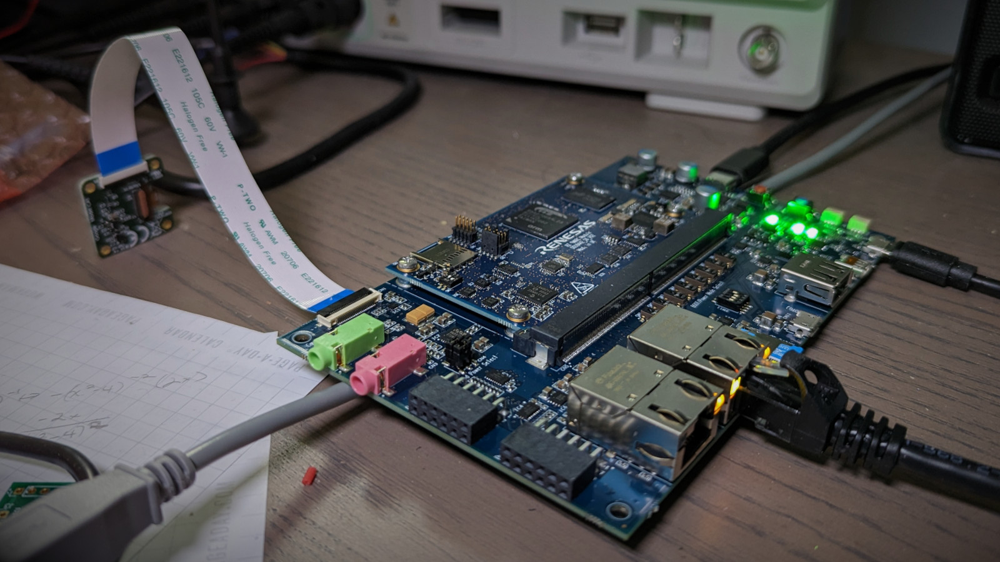
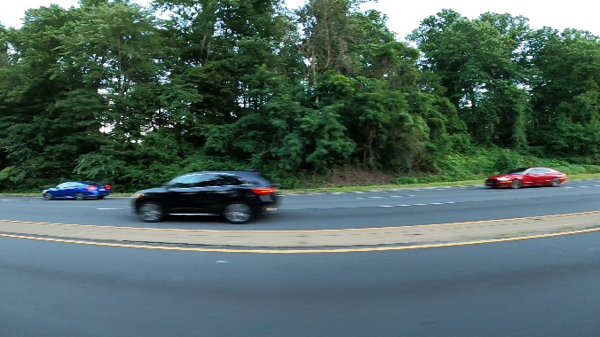
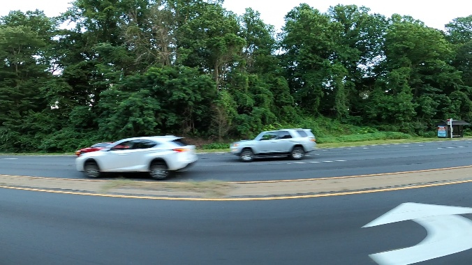
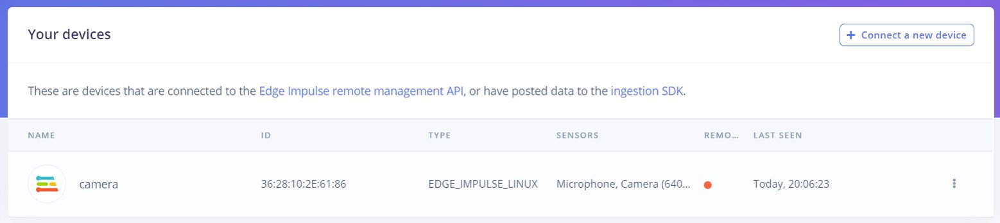
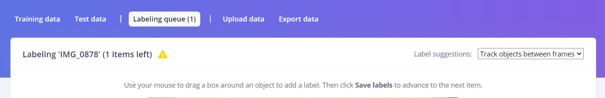
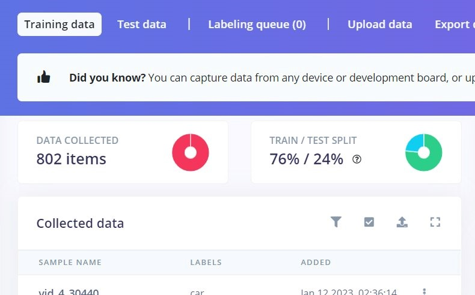
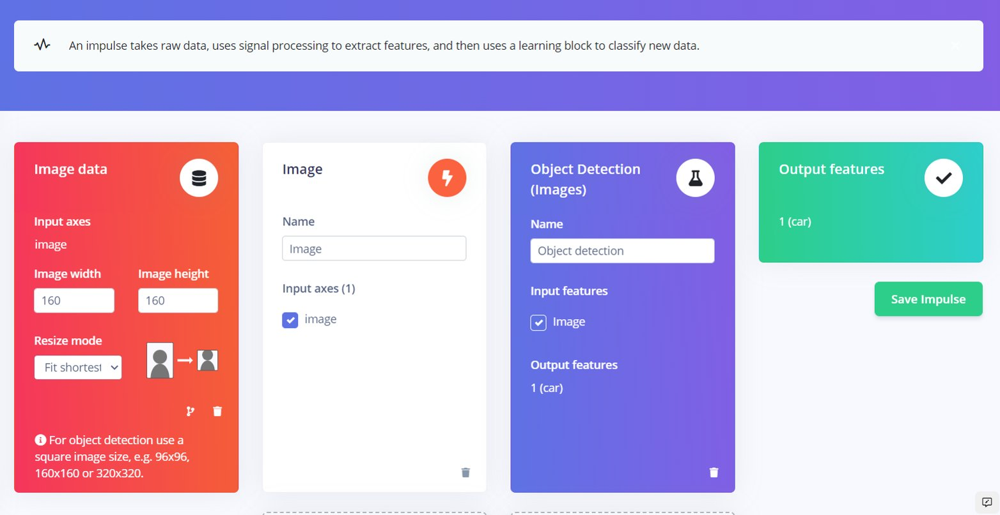
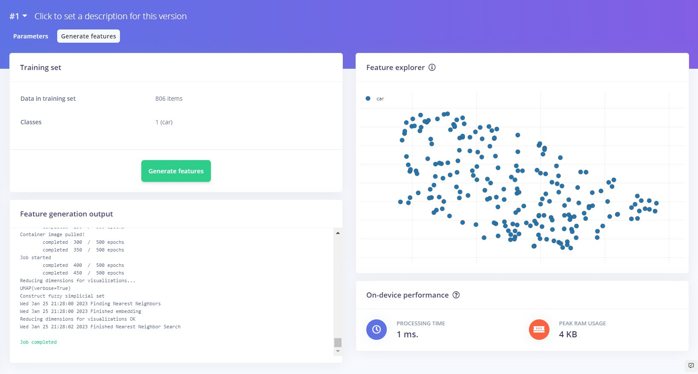
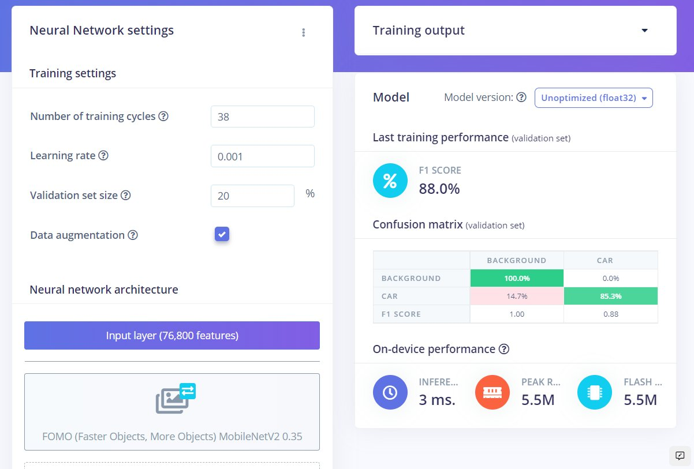
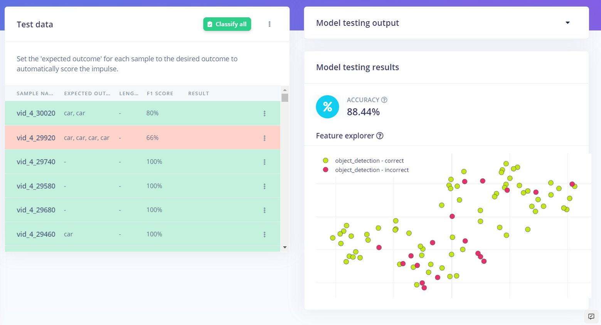

# Renesas RZ/V2L Object Detection Project - Detecting Cars

## Problem Overview

Traffic monitoring often uses intrusive and expensive devices to count the number
cars that pass by a given stretch of road.
I have access to an evaluation board for the Renesas RZ/V2L, which was designed
for computer vision AI applications. Here it is on a messy desk.

Can we build a simple device using the RZ/V2L that
attaches to road signs and counts cars using AI with similar accuracy?

## Dataset

I will be producing a proof of concept using a Renesas RZ/V2L Evaluation Board
Kit. The catch is that I will be sharing time on this board with other students,
and I will be accessing it remotely. In order to bootstrap the process, I will
be using a public dataset from [kaggle](https://www.kaggle.com).

The creator of the dataset had a camera mounted to a moving car. Here are a few sample images.





## Hardware Requirements

- Renesas [RZ/V2L Evaluation Board Kit](https://www.renesas.com/eu/en/products/microcontrollers-microprocessors/rz-mpus/rzv2l-evkit-rzv2l-evaluation-board-kit)
- If you plan on remote access to the board, as I did here, you will
  need a router that allows port-forwarding.
- Possibly an enclosure, depending on where you are placing your board.

## Software Requirements

- Edge Impulse account
- Yocto build for the board (via the instructions from Renesas and Edge Impulse).
- A terminal with `ssh`.

## First Steps

Before starting this project, I wanted to familiarize myself with the Edge
Impulse platform. I had very good luck trying out an image classification example
as a warm-up. If you want something smaller to try out before you get into
object detection on this board, I recommend that you follow
[this guide](https://docs.edgeimpulse.com/docs/tutorials/image-classification)
for a smooth experience to get you some practice and insight.

Heads up: I reference the left navigation a lot. If it is not showing for you on the left side of the screen, you will have to click the menu icon in the top left to access it.

## 1. Board setup

The [setup instructions](https://docs.edgeimpulse.com/docs/development-platforms/officially-supported-cpu-gpu-targets/renesas-rz-v2l)
for the board went relatively smoothly. The only
issues I ran into were that I didn't notice that I had to apply the
`v3.0.0-update2` patch to the Renesas VLP/V package at first, and I didn't
notice until I had already done a few `bitbake`s that I needed to add a few
things to the configuration for Edge Impulse, specifically the `nodejs`
and `npm` packages and updating `glibc`. But they are all in the documentation,
so it shouldn't be a problem for you if you read more carefully than I do.

The general process is

- Either be running [Ubuntu](https://www.ubuntu.com) 20.04 or have it running in a
  [`docker`](https://docs.docker.com/desktop/) container.
- Download the
  [RZ/V Verified Linux Package [5.10-CIP]](https://www.renesas.com/eu/en/software-tool/rzv-verified-linux-package), the [RZ/V2L DRP-AI Support Package [V7.20]](https://www.renesas.com/eu/en/products/microcontrollers-microprocessors/rz-arm-based-high-end-32-64-bit-mpus/rzv2l-drp-ai-support-package),
  the [RZ MPU Graphics Library Evaluation Version for RZ/V2L](https://www.renesas.com/eu/en/products/microcontrollers-microprocessors/rz-arm-based-high-end-32-64-bit-mpus/rz-mpu-graphics-library-evaluation-version-rzv2l)
  (optional but recommended), and the
  [RZ MPU Video Codec Library Evaluation Version for RZ/V2L](https://www.renesas.com/eu/en/products/microcontrollers-microprocessors/rz-arm-based-high-end-32-64-bit-mpus/rz-mpu-video-codec-library-evaluation-version-rzv2l)
  (also optional, but I installed it for this project).
- Create a folder for all this stuff somewhere and decompress everything there; _e.g._,

```bash
mkdir ~/rzv_vlp_v3.0.0
cd ~/rzv_vlp_v3.0.0
unzip ~/RTK0EF0045Z0024AZJ-v3.0.0-update2.zip
tar zxvf ./RTK0EF0045Z0024AZJ-v3.0.0-update2/rzv_bsp_v3.0.0.tar.gz
unzip ~/RTK0EF0045Z13001ZJ-v1.xx_EN.zip
tar zxvf ./RTK0EF0045Z13001ZJ-v1.xx_EN/meta-rz-features.tar.gz
...
```

- Patch the VLP from your working directory with

```bash
patch -p1 < ./RTK0EF0045Z0024AZJ-v3.0.0-update2/rzv_v300-to-v300update2.patch
```

- Edit `poky/meta/conf/sanity.conf` to allow `root` user to run `bitbake` from
  your `docker` container by commenting out the sanity check.

```bash
# INHERIT +=  "sanity"
```

- Modify the BSP layer so the build will work.

```bash
mv -n ../meta-renesas/include/core-image-bsp.inc ../meta-renesas/include/core-image-bsp.inc_org # move the original
grep -v "lttng" ../meta-renesas/include/core-image-bsp.inc_org >> ../meta-renesas/include/core-image-bsp.inc # only include the "lttng" lines in the new file
```

- Start a build environment with

```bash
source poky/oe-init-build-env
```

- Copy the Yocto config template.

```bash
cd ./build
cp ../meta-renesas/docs/template/conf/smarc-rzv2l/*.conf ./conf
```

- Edit `local.conf` to include at least the tools necessary for the Edge Impulse
  CLI runner, but also any other packages you might want to install, or any
  options you might need.

```bash
# Select CIP Core packages
CIP_CORE = "0"

# Add packages
IMAGE_INSTALL_append = " \
    nodejs \
    nodejs-npm \
    "

# Add recipes
BBMASK = "meta-renesas/recipes-common/recipes-debian"
```

- Assuming you are still in the `build` directory, kick off the build!

```bash
bitbake core-image-weston
```

Assuming everything went to plan, you now have a Yocto image in `build/tmp/deploy`
that you can flash to an SD card. Take a look at
[section 4 here](https://renesas.info/wiki/RZ-V/RZ-V2L_SMARC)
for explicit instructions. If you are using `docker`, you'll need to copy
the `build` directory to the host

```bash
docker cp <containerId>:/file/path/within/container /host/path/target
```

Put the SD card into the read on the carrier board (not the SMARC board)
and we are ready to go!

## 2. Connect the Renesas RZ/V2L board to the Edge Impulse Project

After the board was prepared, I forwarded it from port 2461 through my router
and connected to it with `ssh` using the correct port and the user that I created:

```bash
ssh -p2461 myuser@68.81.34.204
```

To connect to the device, you may need to enter a password for you user depending
on if you have one or not. If you are using the `root` user like they do in the
Edge Impulse guide for the RZ/V2L board, then you won't need to bother with
`sudo`ing the commands below.

First I needed to set up `npm` to run as the `root` user and to install
the [`edge-inpulse-linux`](https://github.com/edgeimpulse/edge-impulse-linux-cli) package.

```bash
sudo npm config set user root
sudo npm install edge-impulse-linux -g --unsafe-perm
```

Now that everything is setup and ready to go, we start the Edge Impulse CLI.

```bash
sudo edge-impulse-linux
```

You'll have to sign into your Edge Impulse account to access your models.

---

You should check if your device is connected to your project by going to your [Edge Impulse project](https://studio.edgeimpulse.com/studio/select-project) and clicking **Devices**. Your device should not be named camera at first; I just renamed mine.



If that all worked out for you, you're set! You connected to the board and
you're ready to move onto the other steps.

## 3. Reformat the bounding boxes into JSON for Edge Impulse

Because I have limited access to the physical board, which is shared with other
students, and since this project is only a proof of concept, I decided to train my
model using a public dataset, in this case a car detection dataset
from [kaggle](https://www.kaggle.com/). However, the bounding box data for my
dataset came as a `csv`, where Edge Impulse expects a
[specifically formatted](https://docs.edgeimpulse.com/docs/edge-impulse-cli/cli-uploader#bounding-boxes)
`json` file. Not to be deterred, I decided to create
[a script](https://github.com/ajaxromik/boundingBoxesCSVToJSON/blob/main/converter.py)
to convert the data to the correct format using
[Python](https://www.python.org/downloads/).

If you plan on using images that you take manually, you will need to also manually draw bounding boxes after uploading your data.
In that case, feel free to ignore this script and go straight to uploading your data.

My original `csv` file was in the format

```txt
image_name,x_min,y_min,x_max,y_max
```

so the script should work for you (up to some renaming) if you have the same.
The script will create a `bounding_boxes.labels` file for you.

Click on **Data acquisition** on the left navigation then click on **Upload data**. 
If you uploaded images that you took manually, just use the 'Choose files' button and select your images from your computer. 
If you have a `.labels` file, use the 'Choose files' button, but don't forget to upload the `bounding_boxes.labels` along with the images.

If you have uploaded your images with a `.labels` file, skip to [step 4](#4-prepare-the-model-and-train-it); otherwise, you have to label the data.

Click on **Labeling queue**. 
Now, if your object is part of the 
[COCO Dataset](https://cocodataset.org/#home), click the dropdown on the right and change 
'Track objects between frames' to 'Classify using YOLOv5'.



YOLOv5 will now automatically create bounding boxes, but you can change or add any boxes that you want. 
For all other types of objects, you will have to manually click and hold to draw a bounding box over each object in your images.

## 4. Prepare the model and train it

I followed the tutorial for [Object Detection using FOMO](https://docs.edgeimpulse.com/docs/tutorials/detect-objects-using-fomo), but I should note that there are other options available.
One option is image classification with the MobileNet v1 or v2, following [this tutorial](https://docs.edgeimpulse.com/docs/tutorials/image-classification).
Another option is using the YOLOv5 model, which requires you to use 320x320 for the image resolution in the image design. The training for YOLOv5 may fail without the proper resolution.

Now that we have our data, we should double check to make sure that it is balanced properly. We want about 20% of our data to be set aside for validation after the model is trained. If your sets are nowhere near 80% and 20%, click **Dashboard**, scroll to the bottom of the page and click **Perform train/test split**.



### Impulse Design

Now it's time to design our impulse! First off, click **Create impulse** in the left navigation. 
Using FOMO, we can set our 'Image width' and 'Image height' to anything as long as it is square. 
For example, I used a 160x160 resolution.

**If you are using YOLOv5 and *NOT* FOMO**, the resolution here must be 320x320. If you have been using FOMO as I have been for this tutorial, choose any square resolution.

Set the 'Resize mode' to 'Fit shortest axis'. 
Click **Add a processing block**, and click the **Add** button to the right of 'Image'. Click **Add a learning block**, and click the **Add** button to the right of 'Object Detection (Images)' with the author 'Edge Impulse'. Then click **Save impulse**.

Your impulse should look like this:



Under 'Impulse Design' on the left navigation, click **Image** and change the 'Color depth' to **Grayscale**. Then click **Save parameters**.

Note: FOMO currently can only accept Grayscale images.

You should be taken to the 'Feature generation' screen. 
Just click **Generate features** in order to prepare your images for the machine learning model. 
A feature explorer will appear when the job finishes, and it will look something like this:



### Training the model

At this point, we have our images ready to use to train our machine learning model.

First off, click **Object detection**. 
Change the 'Target' in the top left to be 'Renesas RZ/V2L (with DRP-AI accelerator)'. 
Since I am using the FOMO model, I chose 'FOMO (Faster Objects, More Objects) MobileNetV2 0.35'.
You can also use the YOLOv5 model, just make sure that you have images of 320x320 resolution.

Make sure to use a **Learning rate of 0.001**. Then click **Start training**. Once the model is done, you can see the accuracy numbers like so:



If you've followed along so far, you have now trained your object detection model!

### Testing and deploying the model to your RZ/V2L

All that is left is to test the model and load it onto the board.

In order to test the model, click **Model testing** in the left navigation. Once you are there, click **Classify all** to validate your model.

The result should look something like this:



The impulse is now ready to run on the Renesas RZ/V2L!

---

[\\]: # (This is the last part that needs more content and not just to be edited)

Since we are using a Linux-based device, we can just put

```bash
edge-impulse-linux-runner
```

into the command line on our device.

If you want to download the model onto your device manually, you can use this command:

```bash
sudo edge-impulse-linux-runner --download downloaded-model.eim
```

### Worth mentioning:

Normally the settings to run the training would have me do 60 epochs, but it goes over the allotted usage for a developer's project.
I was able to get it to run with only 38 epochs even though I would have done at least 80 if it was available.
